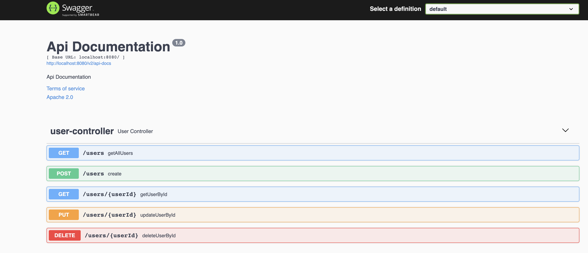

# Sample Reactive  - Spring Boot application
The purpose of this project is to demonstrate how we can use [Spring WebFlux](https://docs.spring.io/spring/docs/current/spring-framework-reference/web-reactive.html) to create a reactive web application

# How to build and run

project can be compiled with JDK 8 and above `javac`.

To compile just do `mvn clean install`.

To run the application execute the following:
```
java -jar target/reactive-examples*.jar
```
You can also use the Swagger-ui.html to test the application.


for more detailed technical information please check my post :


The server will start at <http://localhost:8080>.

## Exploring the Rest APIs

The application contains the following REST APIs

```
1. GET /users - Get All Users

2. POST /users - To create a User

3. GET /users/{userId} - Retrieve an User by Id

3. PUT /users/{userId} - Update an User

4. DELETE /users/{userId} - Delete an User

4. GET /users/events - Stream users to a browser as Server-Sent Events
```
It also creates sample data in the database so that it can be tested. It is idempotent in nature.

It also contain a sample WebClient to retrieve data from our User Management application.

